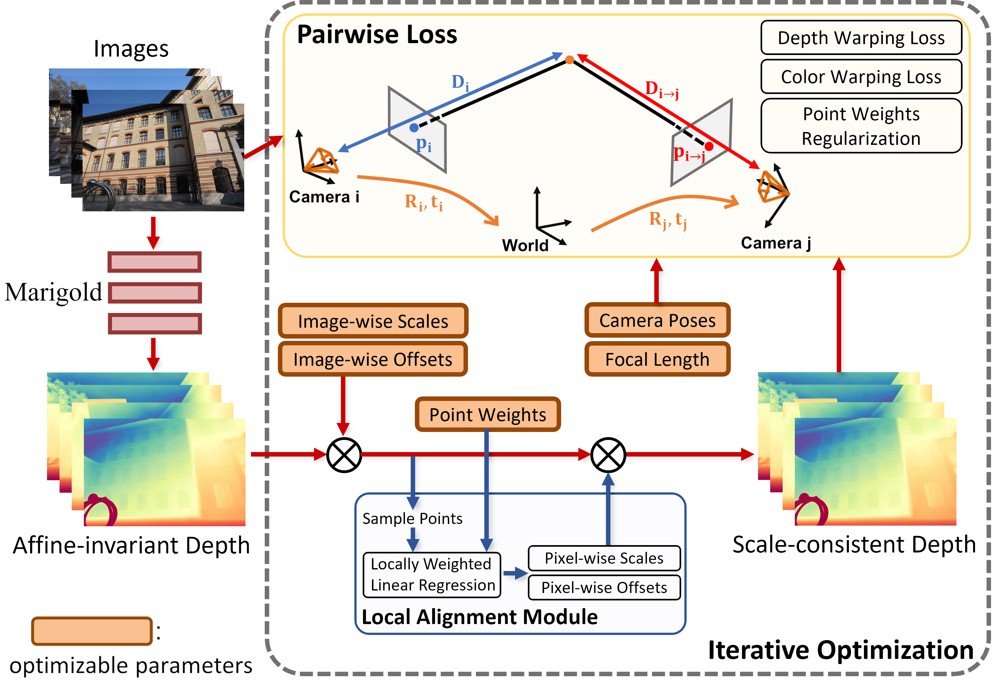

<div align="center">

  <h1 align="center">MarigoldPose: Camera Pose Estimation with Marigold Monocular Depth</h1>
  

</div>

We implement an optimization pipeline (primarily based on [FrozenRecon](https://github.com/aim-uofa/FrozenRecon)) to estimate camera poses. We jointly optimize the scale (global scale) and offset (global offset) for each image, as well as camera poses, camera focal lengths, and point weights used for local alignment. A local alignment module is utilized to guide the optimization of parameters, and accelerate convergence. The loss function consists of color and depth warping losses, along with a regularization term to enforce the point weights close to 1.

## Prerequisite

### Pre-trained Checkpoints
In this project, we use [Marigold](https://github.com/prs-eth/marigold) and [LeReS](https://github.com/aim-uofa/AdelaiDepth/tree/main) to estimate affine-invariant depth maps. LeReS is used just for comparison, as it is used in the FrozenRecon.

Please download the checkpoint of Marigold with
```
bash scripts/download_marigold.sh
```
It usually takes a long time to decompress the checkpoint package.

Please download the checkpoint of LeReS from [here](https://pan.baidu.com/s/1o2oVMiLRu770Fdpa65Pdbw?pwd=g3yi), and place it in `leres/res101.pth`.

### Demo Data
We provide one demo data of ScanNet scene0806 in `data/scannet_scene0806`.

### System Requirements
Our code works on Ubuntu 20.04.


## Installation
```
git clone -b marigold-pose https://github.com/MoyangLi00/MDS-NeRF.git marigold-pose --recursive
cd marigold-pose
```

Setup the environment (Gaussian Splatting submodules are automatically built by following instructions).
```
conda env create -f environment.yaml
conda activate MarigoldPose
```


## Run

To estimate camera poses with Marigold, please use the command as
```
python run.py --depth_est_model marigold --image_path data/scannet_scene0806/images --half_precision
```

To estimate camera poses with LeReS for comparison, please use the command as
```
python run.py --depth_est_model leres --image_path data/scannet_scene0806/images
```

## Evaluate

To compare the results of our method with Marigold and FrozenRecon with LeReS, run
```
python evaluate.py
```

Please change the following paths if you don't use the demo data provided by us
```python
# Change the path of results
gt_pose_path = 'data/scannet_scene0806/pose'
marigold_pose_path = 'outputs/scannet_scene0806/optimized/marigold/cam_pose'
frozen_pose_path = 'outputs/scannet_scene0806/optimized/leres/cam_pose'
opt_params_path = 'outputs/scannet_scene0806/optimized/marigold/optimized_params.pt'
tum_format_traj_dir = 'outputs/scannet_scene0806/evaluation' # Path to save the tum format trajectory file
```

## Code Writen by Us
`run.py` and `evaluate.py` are writen by us. In `run.py`, we utilize functions provided in the official code of Marigold and FrozenRecon, drawing inspiration from the implementation of their main functions. We have modified their code and integrated the two to work together.


## Acknowledgment

- Kudos to the [Marigold](https://github.com/prs-eth/marigold) and [FrozenRecon](https://github.com/aim-uofa/FrozenRecon) contributors for their amazing work:

```bibtex
@InProceedings{ke2023repurposing,
      title={Repurposing Diffusion-Based Image Generators for Monocular Depth Estimation},
      author={Bingxin Ke and Anton Obukhov and Shengyu Huang and Nando Metzger and Rodrigo Caye Daudt and Konrad Schindler},
      booktitle = {Proceedings of the IEEE/CVF Conference on Computer Vision and Pattern Recognition (CVPR)},
      year={2024}
}

@inproceedings{xu2023frozenrecon,
  title={FrozenRecon: Pose-free 3D Scene Reconstruction with Frozen Depth Models},
  author={Xu, Guangkai and Yin, Wei and Chen, Hao and Shen, Chunhua and Cheng, Kai and Zhao, Feng},
  booktitle={Proceedings of the IEEE/CVF International Conference on Computer Vision},
  pages={9310--9320},
  year={2023}
}
```